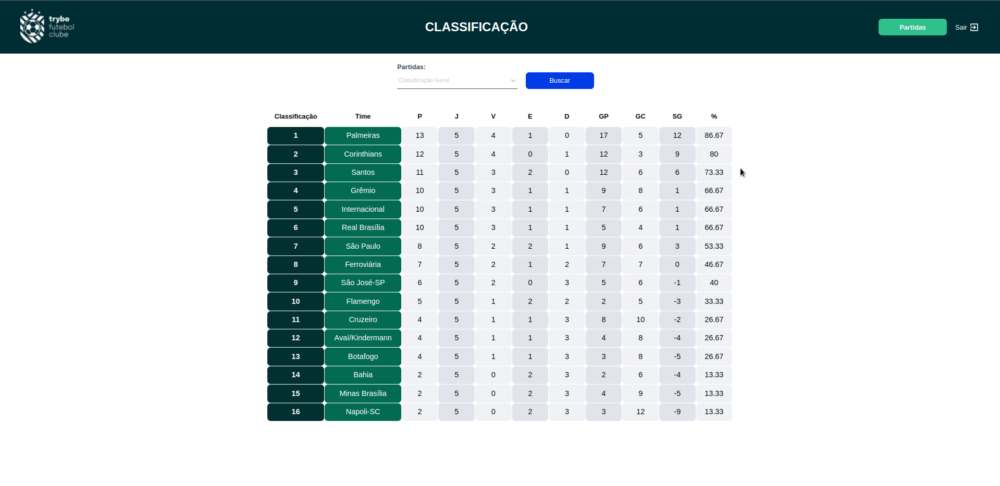

# Boas vindas ao repositório do TFC - Trybe Futebol Clube! ⚽️

O app trybe futebol clube , consiste em uma aplicação que mostra a classificação de acordo com o resultado dos jogos de cada time.
Nesse projeto o frontend foi feito por parte da trybe.

---

## Tecnologias Utilizadas

- Express
- TypeScript
- Sequelize
- MySql
- Node.js
- Docker
- POO
- Testes de integração
   - mocha
   - chai
   - sinon


## O que foi Desenvolvido

Aplicação dockerizada em `Node.js + Typescript` usando o pacote `sequelize`.

## O que precisa para rodar a aplição

 - Ambiente node configurado
 - docker e docker-compose instalados em maquina
 - OBS : O seu docker-compose precisa estar na versão 1.29 ou superior.

## Baixar e installar as depedências
```
git clone git@github.com:vitorSilva95/trybe-futebol-clube.git
```
```
cd trybe-futebol-clube/app
```
```
npm install
```
---
## Executar a aplicação
#### No diretorio /app execute o comando
```
npm run compose:up
```
## Parar a aplicação
#### No diretorio /app execute o comando
```
npm run compose:down
```
## Rodar testes
#### No diretorio /app execute o comando
```
cd /backend
```
```
npm test
```

## Após executar a aplicação acesse no seu navedor a URL:

```
http://localhost:3000/leaderborad
```
## Login na aplicação

- Para manipular as partidas( adicionar ou editar ) você precisa fazer login na aplicação
- email: admin@admin.com
- password: secret_admin

## Gif da aplicação rodando




